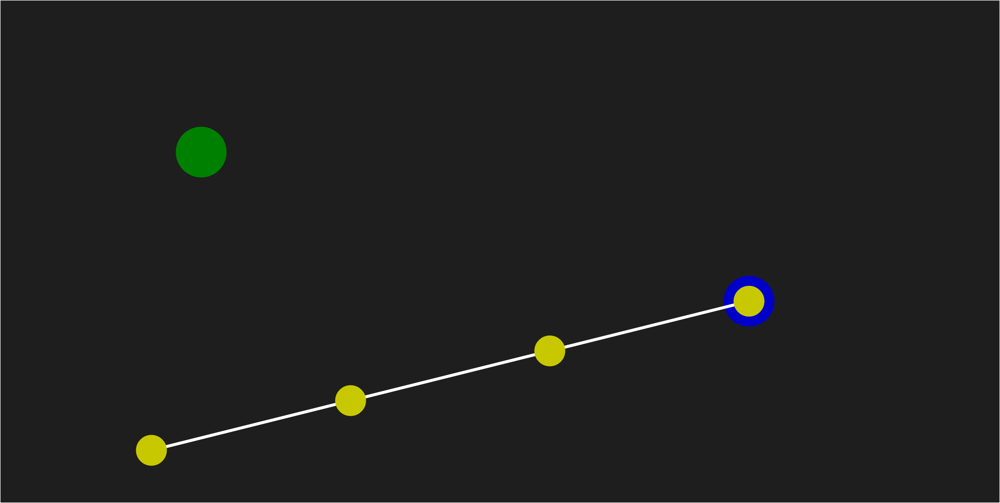
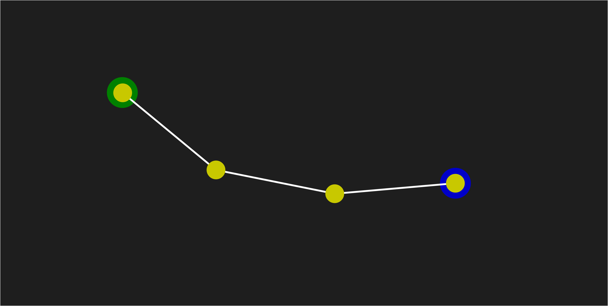

# FABRIK

Implementation of the FABRIK algorithm in JavaScript with p5.js

## Start

## End

## Credit 

 - FABRIK algorithm [https://www.sciencedirect.com/science/article/abs/pii/S1524070311000178?via%3Dihub](https://www.sciencedirect.com/science/article/abs/pii/S1524070311000178?via%3Dihub)
 - I initially learned about this algorithm from this video [https://www.youtube.com/watch?v=PGk0rnyTa1U](https://www.youtube.com/watch?v=PGk0rnyTa1U)
